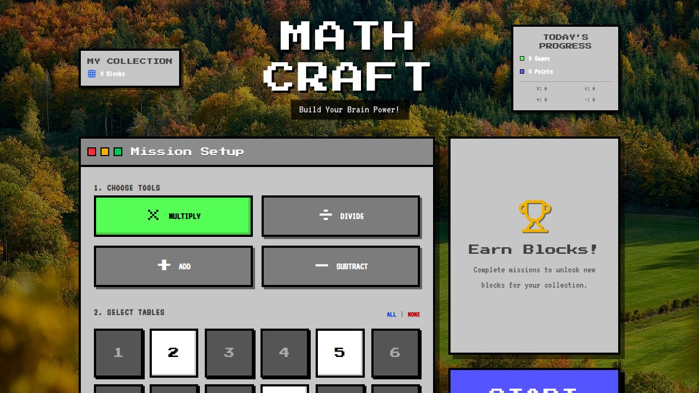

# Math Craft

**Build Your Brain Power!**

Math Craft is an educational math practice game built as a Progressive Web App (PWA) with a Minecraft-themed aesthetic. It helps children practice arithmetic through engaging gameplay, rewarding them with collectible Minecraft blocks.



## Features

- **Four Operations** - Practice multiplication, division, addition, and subtraction
- **Customizable Tables** - Select any combination of tables 1-12
- **60-Second Challenges** - Time-attack mode with streak bonuses
- **Block Collection** - Earn Minecraft blocks (Common, Rare, Epic, Legendary rarities)
- **Multi-User Support** - Track progress for multiple players
- **Offline Support** - Works without internet connection (PWA)
- **Mobile Friendly** - Installable on phones and tablets

## Collectible Blocks

Earn rewards after each game session:

| Block | Rarity |
|-------|--------|
| Grass Block | Common |
| Crafting Table | Common |
| Dried Kelp Block | Common |
| Gold Ore | Rare |
| Diamond Ore | Rare |
| Water | Rare |
| TNT | Epic |
| Sticky Piston | Epic |
| Redstone Lamp | Epic |
| Obsidian | Legendary |
| Powder Snow | Legendary |

## Tech Stack

- React 19 + Vite
- Tailwind CSS 4
- Shadcn UI
- Framer Motion
- PWA with Workbox

## Getting Started

```bash
# Install dependencies
npm install

# Start development server
npm run dev

# Build for production
npm run build

# Preview production build
npm run preview

# Type check
npm run check
```

The development server runs on http://localhost:5000

## Project Structure

```
client/src/
├── pages/           # Route components
├── components/ui/   # Shadcn UI components
├── components/game/ # Game-specific components
├── lib/
│   ├── game-logic.ts  # Problem generation
│   └── storage.ts     # LocalStorage API
└── hooks/           # Custom React hooks
```

## How It Works

1. **Select Operations** - Choose which math operations to practice
2. **Pick Tables** - Select multiplication/division tables (1-12)
3. **Play** - Answer as many problems as possible in 60 seconds
4. **Earn Rewards** - Choose a collectible block after each game
5. **Track Progress** - View stats and build your block collection

## Scoring

- Base: 10 points per correct answer
- Streak Bonus: +2 points per consecutive correct answer
- Incorrect answers reset the streak (no point deduction)

## License

MIT
